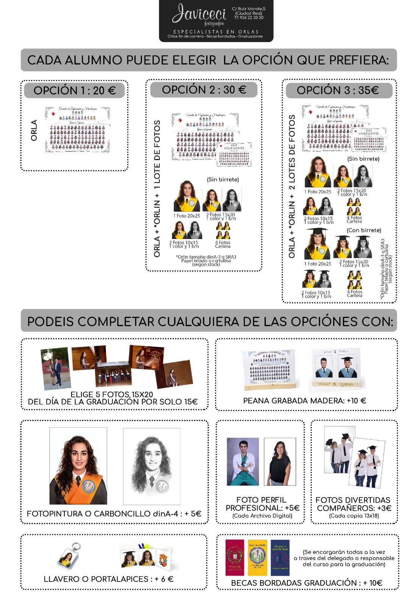

## Notas

**ESTE DOCUMENTO ESTÁ SUJETO A CAMBIOS. TODAVÍA HAY PUNTOS QUE ESTÁN DECIDIÉNDOSE. LA ORGANIZACIÓN SE RESERVA EL DERECHO A MODIFICARLO. *SÍ, LA INSCRIPCIÓN NO ESTÁ HECHA A FECHA DE PUBLICACIÓN DE ESTE DOC, DEJADME DORMIR***

## Información básica

¡Buenas!

La orla de informática de este curso 2024-2025 ya se está organizando.
Este año, como otros, lo haremos con la empresa [Javiceci](https://www.javiceci.com/).
Más abajo podéis ver un resumen de la oferta además del [cartel promocional de Javiceci](#javiceci-cartel).  <!-- markdownlint-disable MD051 -->

{#javiceci-cartel}

Para participar hay que rellenar el [form](https://forms.office.com/e/iR9SrQ9Jgr).
Se recomienda hacerlo después de haber leído toda la información.

## Oferta

Cada alumno podrá elegir una de tres opciones:

1. Orla

   - Orla general, con todos los participantes.
   - Coste 20€.
   - No incluye achivo y papeletas [^1].

2. Orla + Orlín + Lote de fotos

   - Orla general, con todos los participantes.
   - Orla pequeña, sólo con los participantes de tu misma intensificación [^2].
   - Lote de fotos sin birrete (gorro), varias fotos individuales a diferente tamaño [^3].
   - Coste 30€.

3. Orla + Orlín + 2 Lote de fotos

   - Orla general, con todos los participantes.
   - Orla pequeña, sólo con los participantes de tu misma intensificación.
   - Lote de fotos sin birrete (gorro), varias fotos individuales a diferente tamaño.
   - Lote de fotos con birrete (gorro), varias fotos individuales a diferente tamaño.
   - Coste 35€.

[^1]: Con la compra de las ofertas 2 y 3 (orlín y fotos), se incluye archivos digitales de las fotos tomadas además de papeletas (número actualmente desconocido, precio/papeleta 1€) para un sorteo de un SPA en pareja con el objetivo de ayudar a costear la orla, no reembolsable.

[^2]: Orlín tamaño dinA-3 o SRA3. Papel telado o cartulina según stock.

[^3]: 1 foto 20cm $\times$ 25cm. 2 fotos 15cm $\times$ 20cm, 1 color 1 blanco/negro. 2 fotos 10cm $\times$ 15cm, 1 color 1 blanco/negro. 4 fotos cartera.

### Extras

Además de esto, cada alumno podrá elegir **añadir** los siguientes:

1. 5 Fotos (15cm $\times$ 20cm) realizadas durante el día de la graduación, 15€.
2. Peana grabada de madera, 10€.
3. Foto pintura o carboncillo, 5€.
4. Foto perfil profesional, 5€/archivo.

   En digital, se pueden hacer tantas como se quiera con coste de 5€ cada una, de normal es más.
   Si se quiere, hay que ponerse en contacto con [Javiceci](mailto:javiceci@javiceci.com).
   Se requiere pedir cita, se hacen en tienda.

5. Fotos divertidas (13cm $\times$ 18cm), 3€/copia.
6. Llaveros, 6€.
7. Portalápices, 6€.

En caso de quererse alguno de estos o algún extra, habrá que marcarlo en el formulario.
Aunque se puede pedir una vez pasadas las fotos.

Las becas (cintas con el escudo de la escuela) corren a cuenta de la escuela :D, *gracias Jesús Serrano*.

### Incluídos

1. Los paquetes de las orlas (y las fotos) se harán en papel Fuji-profesional [^2].
2. Retoques de imperfecciones.

   Durante la sesión de fotos, si se ve algo, se puede indicar.
   En caso de verse a posteriori, en la página web, también se puede pedir mediante correo a [Javiceci](mailto:javiceci@javiceci.com).

3. Número de fotos ilimitado.

   Durante el día de las fotos, cumpliendo horarios, hasta que se tenga la foto que más guste.

4. Posibilidad de descargar individualmente las fotos.

   Se compartirá un usuario y contraseña proporcionado por Javiceci, entrando en su [página web](https://www.javiceci.com/) e iniciando sesión con estos, se podrá acceder a las fotos.
   Este usuario y contraseña es común para toda la facultad. (*No comment*)

5. Traje para la foto.

   Javiceci aportará la camisa blanca o cuello camisero blanco, corbata, capelina y beca.
   No se disponen de todas las tallas.

### Profesores

Se admitirán hasta un máximo de 20 profesores, a elección de los alumnos.
Reservando 4 plazas para profesores de cada rama y otras 4 para profesores generales.
La elección de los profesores se hará mediante el formulario.

Los profesores **no** tendrán coste para la foto.

Por experiencia de Javiceci, otros años, los profes se suelen hacer las fotos el mismo día que los alumnos.

> El representante deberá comunicar a los profesores que desee que aparezca en la orla, y podrán (los profesores) reservar cita en el 926 22 20 20 o se podrán utilizar aquellos que tenga la empresa en sus archivos de años anteriores, los cuales podrán elegir renovar o no la fotografía.

## Fechas

Para las fotos normales, se votará entre todos los participantes fechas aproximadas, en principio:

1. Finales de Noviembre
2. Principios de Diciemre

Esta votación se realizará mediante el formulario proporcionado.
La fecha a reservar será la mas votada, se pueden votar varias.
Se pedirá reservar la fecha, cuando esta haya sido concretada, se mandará un correo a los participantes con la fecha elegida, además de avisarse por el [actual grupo de whatsapp de cuarto](https://chat.whatsapp.com/CNPwK6FEfDbDTfTlIs1v7a).

En caso de no poderse asistir, se deberá mandar un correo a [Samuel Espejo](mailto:samuel.espejo@alu.uclm.es).
Las fechas, una vez decidias no se pueden cambiar.

El/los día/s de la foto, cada persona tendrá un horario marcado.
Este está pensado para que no se acumule mucha gente y se siga un orden.

## Lugar

Una vez decidida la fecha, las fotos se realizarán en una sala de la escuela reservada para esto.
Allí estará todo el equipamiento necesario, aportado por Javiceci.

La sala estará en la Escuela Superior de Informática, ESI.
Todavía no se sabe la sala en concreto, una vez se concrete fecha, se reservará sala y se eviará un correo a los interesados.

## Pagos

Se realizará el mismo día de la fotografía, en efectivo.

> El precio acordado por ambas partes, y que deberá abonar cada alumno en el momento de la realización de las fotografías, dependerá de la opción elegida.

Se puede ver en la sección de [oferta](#oferta).

*Un donativo también se agracede, aunque sea un bocata o algo del estilo :).*

## Protección de datos

Para participar en la orla es **NECESARIO** firmar el consentimiento del tratamiento de datos por parte de Javiceci.
Este será que las fotos tanto individuales como de grupo podrán subirse a la web de Javiceci con una clave privada para la carrera con el fin de hacer correcciones.

El consentimiento se firmará a medida que se vayan haciendo las fotos, firmando tanto el consentimiento como la asistencia y realizando el pago.

## Entrega de la orla

Donde se acuerde con Javiceci, con posibilidades:

1. El día de la graduación, en la próxima Santa Tecla 2025, recogido por mí de la tienda antes de esta.
2. Cada alumno recoge en tienda.
3. Se entrega en facultad y nos organizamos nosotros, posiblemente como la 1, permitiendo que se recoja en conserjería.

Por defecto, se recogerá en el estudio de Javiceci.

## Cuestiones extras

> Una vez enviada la pureba por la empersa al representante de la carrera para su correción, y dando este su visto bueno, no se incluirá en esta a ningún nuevo alumno.
> En caso de existir algún nuevo alumno, se le podrá hacer a este, una orla especial, previo pago de su importe, acordado por ambas partes.

Cualquier otra pregunta, contactar con [Samuel Espejo](mailto:samuel.espejo@alu.uclm.es).

**ESTE DOCUMENTO ESTÁ SUJETO A CAMBIOS. TODAVÍA HAY PUNTOS QUE ESTÁN DECIDIÉNDOSE. LA ORGANIZACIÓN SE RESERVA EL DERECHO A MODIFICARLO. *SÍ, LA INSCRIPCIÓN NO ESTÁ HECHA A FECHA DE PUBLICACIÓN DE ESTE DOC, DEJADME DORMIR***
